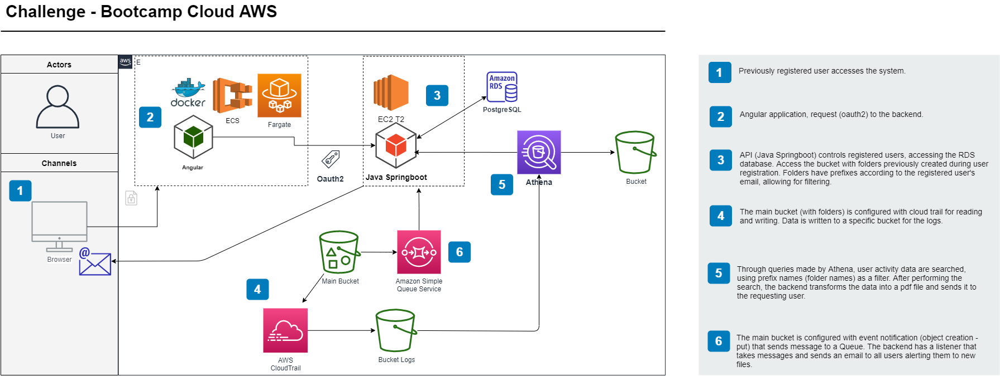

# Aws Challenger - Bootcamp Cloud AWS

Project developed in Java Spring Boot and Angular 9 using AWS resources (S3, SES, EC2, SQS, Amazon RDB, Cloud Trail, Athena)

# Aws-Challenger




# Backend  


Project created with [Spring Boot](http://projects.spring.io/spring-boot/).

### Requirements

For building and running the application you need:

- [JDK 1.8](http://www.oracle.com/technetwork/java/javase/downloads/jdk8-downloads-2133151.html)
- [Maven 3](https://maven.apache.org)


### Running the application locally

There are several ways to run a Spring Boot application on your local machine. One way is to execute the `main` method in the `AwsDesafioApplication` class from your IDE.

Alternatively you can use the [Spring Boot Maven plugin](https://docs.spring.io/spring-boot/docs/current/reference/html/build-tool-plugins-maven-plugin.html) like so:

```shell
# Run the application
$ mvnw spring-boot:run

# Build for deploy
$ mvnw clean package
```
<br>
<br>

# Frontend 

Project created with [Angular CLI](https://github.com/angular/angular-cli)

### Requirements

Both the CLI and generated project have dependencies that require Node 8.9 or higher, together with NPM 5.5.1 or higher.

- Installing globally
```bash
npm install -g @angular/cli
```
- Installing locally
```bash
npm install -g @angular/cli
```

### Development server

Run `ng serve` for a dev server. Navigate to `http://localhost:4200/`. The app will automatically reload if you change any of the source files.

### Build

Run `ng build` to build the project. The build artifacts will be stored in the `dist/` directory. Use the `--prod` flag for a production build.


## Documentation

The documentation for the Angular CLI is located on our [documentation website](https://angular.io/cli).

## License

[MIT](https://github.com/angular/angular-cli/blob/master/LICENSE)
